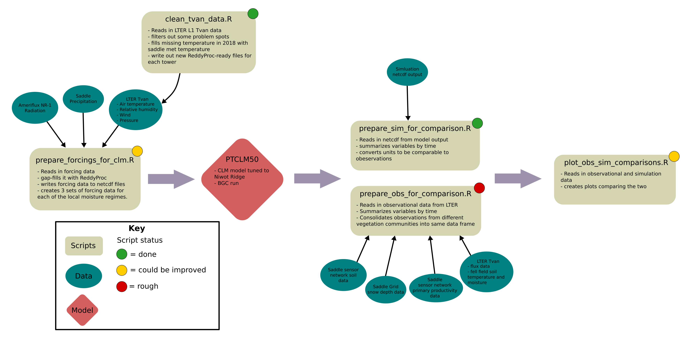

# NWT_CLM
This repoistory contains scripts that are necessary for running and analyzing data from CLM point simulations at Niwot Ridge, using Tvan Forcing data. 

## Niwot scripts workflow:

1. Clean L1 tvan data using `tvan_supplemental_cleaning.R`*
2. Use `flow.lter.clm.R` to generate netcdf forcings for the model.
3. Follow the instructions in `CLM_instructions.md` to run the model at Niwot Ridge
4. Run `flow.obs.R` to download and format observations for comparison with the model
5. Run `flow.sim.R` to format model output for comparisons with observations
6. Run `Obs_sim_com_plots.R` to create comparison plots between simulation and observations

*This script will be rendered obsolete once the Tvan data is available on AmeriFlux 




## How to run each script

### 1. `tvan_supplemental_cleaning.R`

This script cleans up Tvan L1 data that has been produced with the Niwot LTER `tvan_L1_preprocess.R` script from the Niwot LTER's repository. It is a temporary script meant to add a few extra cleaning steps to the L1 tvan data, until that data can be uploaded to AmeriFlux. The script reads in ReddyProc-ready data output by the `tvan_L1_preprocess.R` script, filters several problem spots, plots yearly comparisons between the filtered and unfiltered data, downloads Saddle Met data from EDI to fill in the gaps in air temperature after 2016, and writes out the data to two files called `tvan_[tower]_[start_timestamp]_to_[end_endtimestamp]_flux_P_reddyproc_supproc.txt`

#### Inputs
 1. ReddyProc-ready files from `tvan_L1_preprocess.R`; This script expects those files to have the following variables
  - `NEE` - Net ecosystem exchange (umolm-2s-1)
  - `LE` - Latent heat flux (Wm-2)
  - `H` - Sensible heat flux (Wm-2)
  - `Ustar` - friction velocity (ms-1)
  - `Tair` - Air temperature (degC)
  - `VPD` - Vapor pressure density (kPa)
  - `rH` - relative humidity (unitless fraction)
  - `U` - Wind speed (ms-1)
  - `P` - Atmospheric Pressure (kPa)
  - `Tsoil` - Soil temperature (degC)
  - `Year` - Year of measurement (MST)
  - `DoY` - Day of year of measurement (MST)
  - `Hour` - decimal hour of measurement (MST)
  
 2. Air temperatures taken from Saddle Met data from EDI. This is automatically downloaded from EDI. Since it is only meant to fill in the gap in air temperature at 2016, only gaps from 2016+ are filled with Saddle air temperature data. 
 
#### User Options
 - `makeplots` - should plots be made? (`TRUE` or `FALSE`)
 - `DirOutBase` - The output directory for the script. It is recommended but not required that this be the same directory that holds the Reddyproc-ready files produced by tvan_L1_preprocess.R
 - `tower` - the tower data be supplementally processed, options are "East", "West", or "Both". If "Both" the both towers will be processed at once.
 - `east_data_fp` - The location of the east tvan data filepath, use "", if `tower = "West"`
 - `west_data_fp` - The location of the west tvan data filepath, use "", if `tower = "East"`

#### Outputs
The script will create a directory called `supp_filtering` in the `DirOutBase` location and save the filtered data to that directory. A directory to hold the Saddle Met data will be created within this directory and if `makeplots = TRUE` it will also create a directory called `plots` within the `supp_filtering` directory to hold the yearly plots of each variable. 

File structure: 

```bash
<DirOutBase>
└── supp_filtering
    ├── Plots
    |   └── [variable]_yearly_plots
    ├── tvan_[tower]_[start_timestamp]_to_[end_endtimestamp]_flux_P_reddyproc_supproc.txt
    └── saddle_met_data

```

### 2. `flow.lter.clm.R`
The `flow.lter.clm.R` script generates atmospheric forcings for CLM from Niwot Ridge. It assembles the forcings with observational data from three sources. Daily precipitation data from the saddle that has been distributed into half-hourly data according to the method laid out in Wieder et al. 2017, half-hourly radiation data from the NR1 AmeriFlux tower, the rest of the forcings from the Tvan towers at Niwot.

| <span> |
| :--- |
| **NOTE:** For this script to work, the user must have an AmeriFlux username and account. |
| <span> |

#### Inputs
 1. Tvan data from the Niwot Ridge Tvan towers, either tower can be used, or both. If both are used, then one tower will be used to gap-fill the other. For the variables that are fed into the model, the two towers have good congruence. Right now, the user specifies the location the data generated by `supplemental_cleaning.R`, but eventually, the data will be on Ameriflux and the `download_amflx()` function can be used to download this data. 
 
 2. Saddle daily precipitation data, these are automatically downloaded from EDI. As are C1 precipitation data from USCRN. The C1 data are used to distribute the daily precipitation from the Saddle proportionally into 30-minute timesteps. 
 
 3. AmeriFlux NR1 tower radiation data, these are automatically downloaded and used to provide short and long-wave radiation data for the forcings. 


#### User Options
 - `makeplots` - should plots be made? (`TRUE` or `FALSE`)
 - `DirOutBase` - the base directory for output, tagged with time and date version
 - `DirDnld` - Directory to download precipitation and radidation data to
 - `getNewData` - flag to determine if a newer version of precip data be automatically downloaded if one is available.
 - `amf_usr` - AmeriFlux username; NOTE: you cannot download Ameriflux data without a valid username to create an account, visit the Ameriflux website: https://ameriflux.lbl.gov/ Please also read their data-use policy, by downloading their data you are agreeing to follow it. The policy can be found here: https://ameriflux.lbl.gov/data/data-policy/
 - `tower` - the Tvan tower that will be used for the forcings. Options are "East", "West", or "Both". If "Both" the one tower will be used to gapfill the other tower basetower provides which tower is the baseline that will be filled with the other tower. Currently the East tower record is more complete and has fewer gaps and errors, so it is being used as the basetower.
 - `basetower` - The tower that will be used as the default, any gaps, will be filled with the other tower if tower is set to "Both"; Options are: "East" or "West". Recommended default is "East"
 - `east_data_fp` - The location of the east tvan data filepath, use "", if tower = "West". This is the location of the East tower output from `supplemental_cleaning.R` 
 - `west_data_fp` - The location of the east tvan data filepath, use "", if tower = "East". This is the location of the West tower output from `supplemental_cleaning.R` 
 
Options currently under development:

- `simulated_runoff_fp` - A character string specifying the location of the simulated runoff data from a moist meadow simulation to be added to Wet meadow precipitation. 

#### Outputs

**The `data` folder**

 - Five folders containing netcdf files for each of the precipitation regimes for the 4 vegetation communities, plus a folder with netcdf files of unaltered precipitation ("original") are produced. 
 - 3 text files are also produced:
   - `tvan_forcing_data_[tower]_[start_date]_[end_date].txt` - The ungapfilled data (prior to ReddyProc gapfilling); if `tower = "Both"` then this will be the data after both towers have been combined. 
   - `tvan_forcing_data_flagged_both_towers_[start_date]_[end_date].txt` - Flags indicating where data from one tower has been used to gap-fill another tower if `tower = "Both"`
   - `tvan_forcing_data_[tower]_[start_date]_[end_date].txt` - The fully gap-filled (with ReddyProc dataset including a precipitation column for each vegetation community's modified precipitation value)
   
**The `plots` folder**

 - `yearly_gap_plots_[year].png` - yearly plots showing gaps in the data prior to gap-filling of any kind
 - `all_years_gap_plots.png` - Plots showing gaps in the data prior to gap-filling for the whole period of forcing data.
 - `[start_date]_[end_date]_required_forcings_postgapfilling.png` - plots showing gaps in data after gap-filling for the whole period of forcing data
 - `[year]_yearly_gap_plots_postgapfilling.png` - yearly plots showing any gaps in the data after gap-filling is complete. 

**Directory structure:**

```bash
<DirOutBase>
└── <data_version>
    ├── data
    │   ├── tvan_forcing_data_both_towers_2007-05-11_2020-08-11.txt
    │   ├── tvan_forcing_data_flagged_both_towers_2007-05-11_2020-08-11.txt
    │   ├── tvan_forcing_data_precip_mods_both_towers_2007-05-11_2020-08-11.txt
    │   ├── dry_meadow
    │   │   ├── 2007-05.nc
    |   |   ....
    │   │   └── 2020-08.nc
    │   ├── fell_field
    │   │   ├── 2007-05.nc
    |   |   ....
    │   │   └── 2020-08.nc
    │   ├── moist_meadow
    │   │   ├── 2007-05.nc
    |   |   ....
    │   │   └── 2020-08.nc
    │   ├── original
    │   │   ├── 2007-05.nc
    |   |   ....
    │   │   └── 2020-08.nc
    │   ├── snow_bed
    │   │   ├── 2007-05.nc
    |   |   ....
    │   │   └── 2020-08.nc
    │   └── wet_meadow
    │       ├── 2007-05.nc
    |       ....
    │       └── 2020-08.nc
    └── plots
        ├── 2007-05-11_2020-08-10_required_forcing_postgapfilling.png
        ├── 2007_yearly_gap_plots_postgapfilling.png
        ....
        ├── 2020_yearly_gap_plots_postgapfilling.png
        ├── all_years_gap_plots.png
        ├── yearly_gap_plots_2007.png
        ....
        └── yearly_gap_plots_2020.png

```

### 3. `flow.obs.R`
#### Inputs
#### User Options
#### Outputs

### 4. `flow.sim.R`
#### Inputs
#### User Options
#### Outputs

### 5. `Obs_sim_com_plots.R`

#### Inputs
#### User Options
#### Outputs

